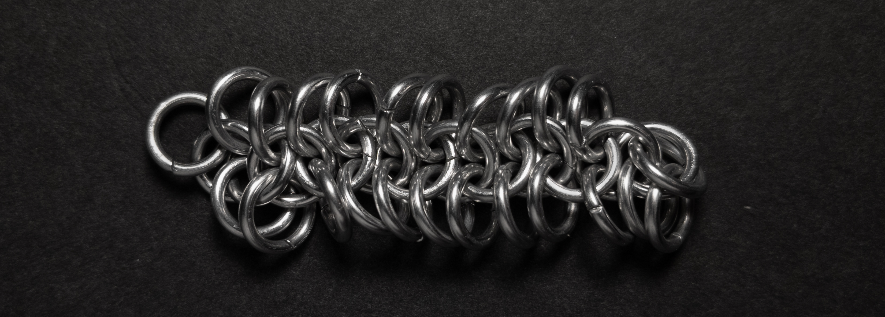
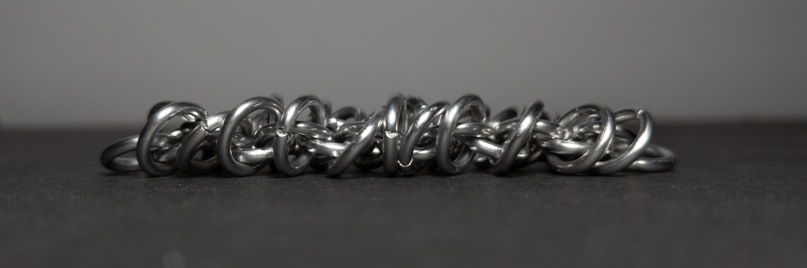
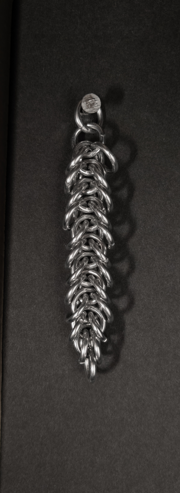
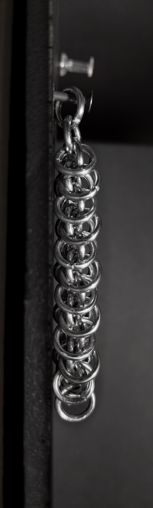
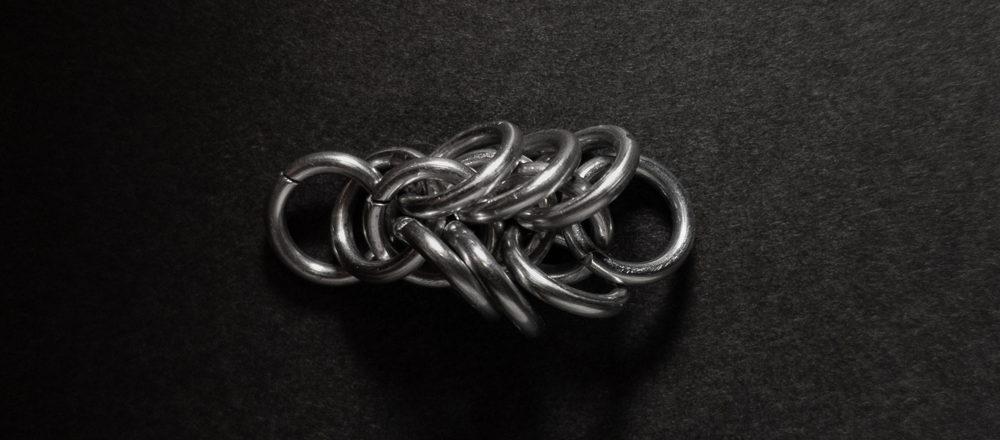
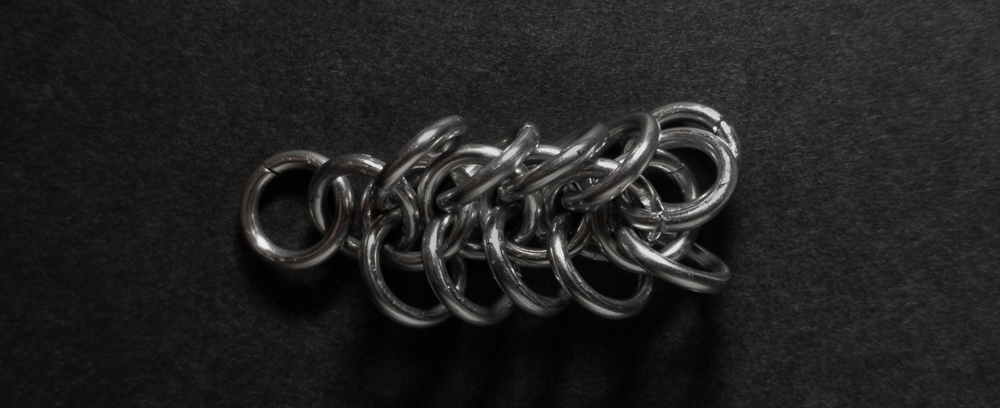
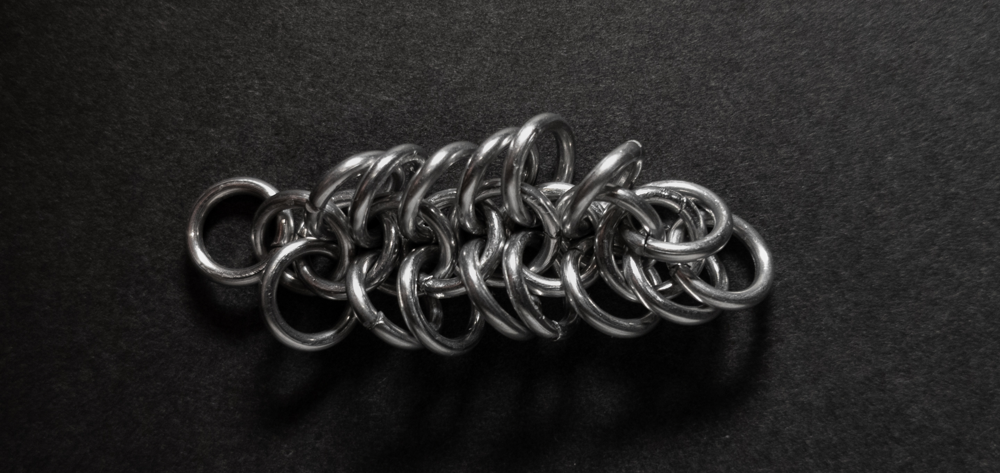
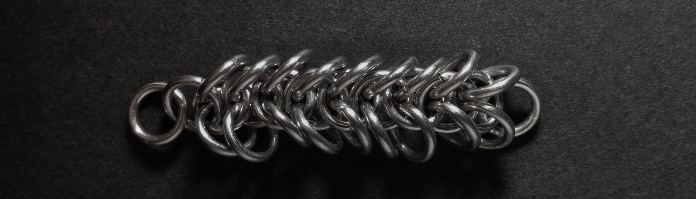

 posted: 2023-07-16 - updated: 2023-07-23 

## Zymira Chain

### Overview

Recently I found a [tutorial](https://www.mailleartisans.org/articles/articledisplay.php?key=743) by [Adalias](https://www.mailleartisans.org/members/memberdisplay.php?key=23061) on [M.A.I.L.](https://www.mailleartisans.org/) that covers the [Zymira Chain](https://www.mailleartisans.org/weaves/weavedisplay.php?key=1294) weave. The Zymira chain is a simple and elegant modification of the basic 2 in 1 chain. If that sounds interesting, I highly suggest you try it out yourself.

### Materials

For the sample piece showcased in this post, I used Bright Aluminum rings purchased from [The Ring Lord](https://theringlord.com/). The rings are 16 SWG with a 1/4" internal diameter, resulting in an aspect ratio of 4.03.

### Notes

The Zymira Chain weave is simple to understand and create. However, it is essential to pay attention to the orientation of the rings to maintain consistency while weaving. The unique construction of the weave results in an impressive visual impact when it is in a vertical position, but its appearance is not as appealing when it lies flat. The weave's more rectangular cross-section and emphasis on verticality make it particularly well-suited for use as a pendant or in earrings. To ensure stability, it is advisable to add a few extra rings at the end of the weave. I find the Zymira Chain weave visually captivating and believe it is worth the effort to learn.

### Pictures

#### Flat

#### Flat: Profile

#### Vertical

#### Vertical: Profile

#### In Process

 

 

 

